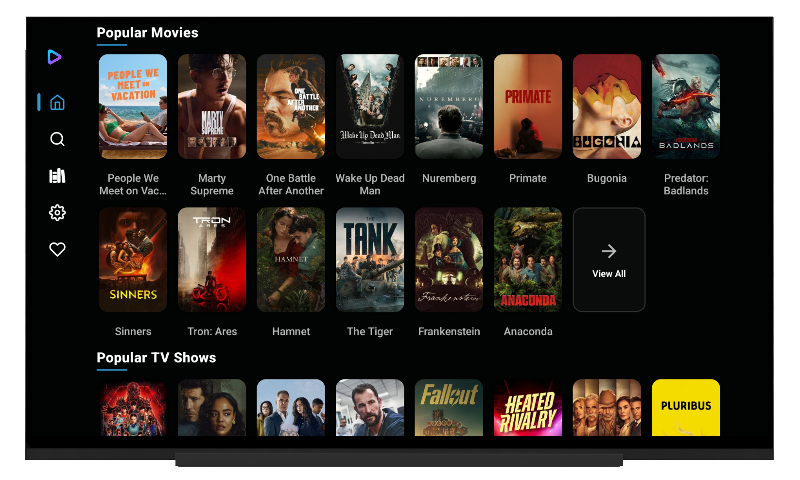
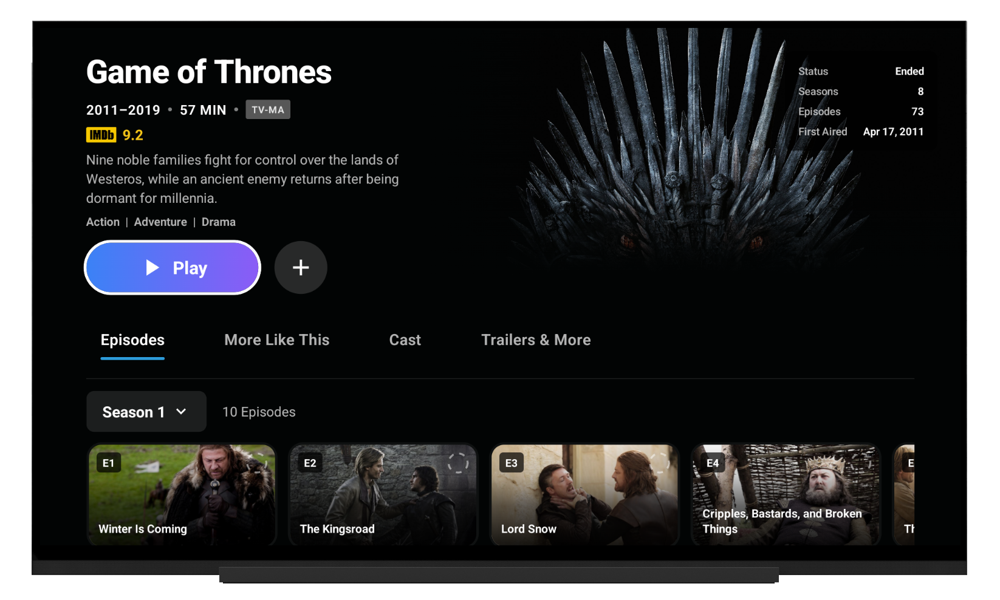

#No longer being developed
## please go to link below for The continued development
<a href="https://github.com/tapframe/NuvioTV">https://github.com/tapframe/NuvioTV</a>

<!-- Improved compatibility of back to top link -->
<a id="readme-top"></a>

<!-- PROJECT SHIELDS -->
[![Contributors][contributors-shield]][contributors-url]
[![Forks][forks-shield]][forks-url]
[![Stargazers][stars-shield]][stars-url]
[![Issues][issues-shield]][issues-url]
[![License][license-shield]][license-url]

<!-- PROJECT LOGO -->
<br />
<div align="center">
  
  <h1 align="center">Nuvio TV</h1>
  <p align="center">
    A TV-optimized media hub built with React Native and Expo
    <br />
    Fork of <a href="https://github.com/tapframe/NuvioStreaming">NuvioStream</a> by Tapframe
    <br />
    <br />
    Stremio Addon ecosystem • TV & Big Screen optimized • D-pad navigation
    <br />
    <br />
    <a href="#getting-started"><strong>Get Started »</strong></a>
    <br />
    <br />
    <a href="#demo">View Screenshots</a>
    ·
    <a href="https://github.com/tapframe/NuvioStreaming/issues/new?labels=bug&template=bug_report.md">Report Bug</a>
    ·
    <a href="https://github.com/tapframe/NuvioStreaming/issues/new?labels=enhancement&template=feature_request.md">Request Feature</a>
  </p>
</div>

<!-- TABLE OF CONTENTS -->
<details>
  <summary>Table of Contents</summary>
  <ol>
    <li><a href="#about-the-project">About The Project</a></li>
    <li><a href="#features">TV Features</a></li>
    <li><a href="#installation">Installation</a></li>
    <li><a href="#demo">Screenshots</a></li>
    <li><a href="#getting-started">Getting Started</a></li>
    <li><a href="#contributing">Contributing</a></li>
    <li><a href="#support">Support</a></li>
    <li><a href="#license">License</a></li>
    <li><a href="#acknowledgments">Acknowledgments</a></li>
    <li><a href="#built-with">Built With</a></li>
  </ol>
</details>

<!-- ABOUT THE PROJECT -->
## About The Project

**Nuvio TV** is a fork of [NuvioStream](https://github.com/tapframe/NuvioStreaming) by [Tapframe](https://github.com/tapframe), specifically optimized for TV and big screen experiences. Built with React Native + Expo, it brings the flexible addon ecosystem of NuvioStream to your living room with full D-pad/remote navigation support.

This project adapts the original mobile-first NuvioStream application to work seamlessly on Android TV, Fire TV, and other TV platforms while maintaining compatibility with the Stremio addon ecosystem.

<p align="right">(<a href="#readme-top">back to top</a>)</p>

<!-- TV FEATURES -->
## Features

- **TV-Optimized UI** - Interface designed for 10-foot viewing experience
- **D-pad Navigation** - Full remote control and gamepad support
- **Focus Management** - Clear visual focus indicators for navigation
- **Stremio Addons** - Compatible with the Stremio addon ecosystem
- **Large Screen Layout** - Optimized layouts for TV resolutions

<p align="right">(<a href="#readme-top">back to top</a>)</p>

<!-- DEMO / SCREENSHOTS -->
## Demo
<a id="demo"></a>

| Home | Details |
|:----:|:-------:|
|  |  |

<p align="right">(<a href="#readme-top">back to top</a>)</p>

<!-- GETTING STARTED -->
## Getting Started

Follow the steps below to run the app locally for development.

### Development Build

<details>
  <summary>Build from Source</summary>

```bash
git clone https://github.com/your-username/NuvioStreamingTv.git
cd NuvioStreamingTv
npm install
# If you hit peer dependency conflicts:
# npm install --legacy-peer-deps
npx expo start
```

```bash
npx expo prebuild
npx expo run:android  # Android TV
```

</details>

<p align="right">(<a href="#readme-top">back to top</a>)</p>

## Contributing

Contributions make the open-source community amazing! Any contributions are greatly appreciated.

1. Fork the project
2. Create your feature branch (`git checkout -b feature/AmazingFeature`)
3. Commit your changes (`git commit -m 'Add some AmazingFeature'`)
4. Push to the branch (`git push origin feature/AmazingFeature`)
5. Open a Pull Request

<p align="right">(<a href="#readme-top">back to top</a>)</p>

## Support

If you find Nuvio TV helpful, consider supporting project:

* **Ko-Fi** – `https://ko-fi.com/crisszollo`
* **GitHub Star** – Star both this repo and the [original NuvioStream](https://github.com/tapframe/NuvioStreaming)
* **Share** – Tell others about the project

<p align="right">(<a href="#readme-top">back to top</a>)</p>

## License

Distributed under the GNU GPLv3 License. See `LICENSE` for more information.

<p align="right">(<a href="#readme-top">back to top</a>)</p>

## Acknowledgments

* [NuvioStream](https://github.com/tapframe/NuvioStreaming) by [Tapframe](https://github.com/tapframe) - The original project this is forked from
* [React Native](https://reactnative.dev/)
* [Expo](https://expo.dev/)
* [TypeScript](https://www.typescriptlang.org/)
* Community contributors and testers

**Disclaimer:** This application functions as a media hub with addon/plugin support. It does not contain any built-in content or host media content. Content access is only available through user-installed plugins and addons. Any legal concerns should be directed to the specific websites providing the content.

<p align="right">(<a href="#readme-top">back to top</a>)</p>

## Built With

<p align="left">
  <a href="https://skillicons.dev">
    
  </a>
  <br/>
  React Native • Expo • TypeScript
</p>

<p align="right">(<a href="#readme-top">back to top</a>)</p>

<!-- MARKDOWN LINKS & IMAGES -->
[contributors-shield]: https://img.shields.io/github/contributors/tapframe/NuvioStreaming.svg?style=for-the-badge
[contributors-url]: https://github.com/tapframe/NuvioStreaming/graphs/contributors
[forks-shield]: https://img.shields.io/github/forks/tapframe/NuvioStreaming.svg?style=for-the-badge
[forks-url]: https://github.com/tapframe/NuvioStreaming/network/members
[stars-shield]: https://img.shields.io/github/stars/tapframe/NuvioStreaming.svg?style=for-the-badge
[stars-url]: https://github.com/tapframe/NuvioStreaming/stargazers
[issues-shield]: https://img.shields.io/github/issues/tapframe/NuvioStreaming.svg?style=for-the-badge
[issues-url]: https://github.com/tapframe/NuvioStreaming/issues
[license-shield]: https://img.shields.io/github/license/tapframe/NuvioStreaming.svg?style=for-the-badge
[license-url]: http://www.gnu.org/licenses/gpl-3.0.en.html
